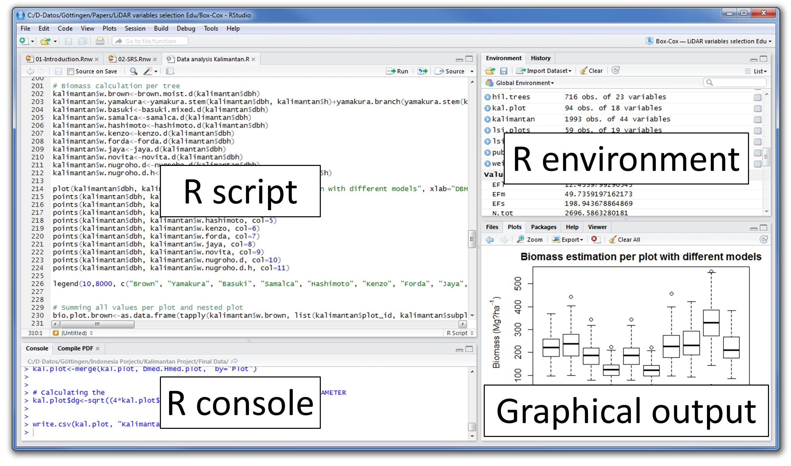

```{r setup, include=FALSE}
knitr::opts_chunk$set(echo = TRUE, 
                      message = FALSE, 
                      warning = FALSE)
```

# R Studio

```{r pressure, echo=FALSE, fig.cap="", out.width='80%', fig.align="center"}

```


# Eindimensionale Vektoren

```{r example_vector}
namen_vektor <- c("Anton", "Anton", "Berta", "Berta")
noten_vektor <- c(2, 3, 4, 1)

names(noten_vektor) <- namen_vektor

print(noten_vektor)
```

# Funktionen

```{r}
help(c)
help(mean)
mean(noten_vektor)
```

```{r}
mittelwert <- function(x){
  summe <- sum(noten_vektor)
  anzahl <- length(noten_vektor)
  return(summe / anzahl)
}

mittelwert(noten_vektor)
```

# Zweidimensionale Matrizen

```{r example_matrix}
noten_matrize <- matrix(data = noten_vektor,
                        nrow = 2,
                        byrow = TRUE)

rownames(noten_matrize) <- c("Anton", "Berta")
colnames(noten_matrize) <- c("Mathe-Klausur", "Statistik-Klausur")

print(noten_matrize)
```

# Faktoren

```{r example_factor}
geschlecht_faktor <- factor(x = c("Mann", "Mann", "Frau", "Frau"))

print(geschlecht_faktor)
```

# Datensätze

```{r}
klausuren_vektor <- c("Mathe", "Statistik", "Mathe", "Statistik")
klausur_daten <- data.frame(Name = namen_vektor, 
                            Geschlecht = geschlecht_faktor,
                            Klausur = klausuren_vektor, 
                            Note = noten_vektor)
klausur_daten
```


# Ausblick: Datenanalyse

```{r}
library(tidyverse)

klausur_daten %>% 
  group_by(Geschlecht) %>% 
  summarize(Notendurchschnitt = mittelwert(Note),
            Standardabweichung = sd(Note))

```

# Vertiefung: Programmieren

- Listen
- Operatoren
- Bedingte Anweisungen
- Schleifen

# Gruppenarbeit

```{r group_work, echo=FALSE, fig.cap="", out.width='80%', fig.align="center"}

```


# Netzbasierte Versionsverwaltung

- Alle Kursmaterialien sind frei zugänglich und befinden sich in diesem [Github Repositorium](https://github.com/wasilios-hariskos/csd-berlin20).
- Github ist ein Internetdienst für die Versionsverwaltung Git.
- Github ist sehr beliebt bei Wissenschaftlern und Programmierern und erleichtert die kollaborative Datenanalyse.
- Buchkapitel [Github and Git](https://r-pkgs.org/git.html) aus dem Buch [R Packages](https://r-pkgs.org/)
- Buch [Happy Git with R](https://happygitwithr.com/)
- Wissenschaftlicher Artikel [A Quick Introduction to Version Control with Git and GitHub](https://journals.plos.org/ploscompbiol/article?id=10.1371/journal.pcbi.1004668)
- YouTube Video [An Introduction to Git and GitHub](https://www.youtube.com/watch?v=MJUJ4wbFm_A)